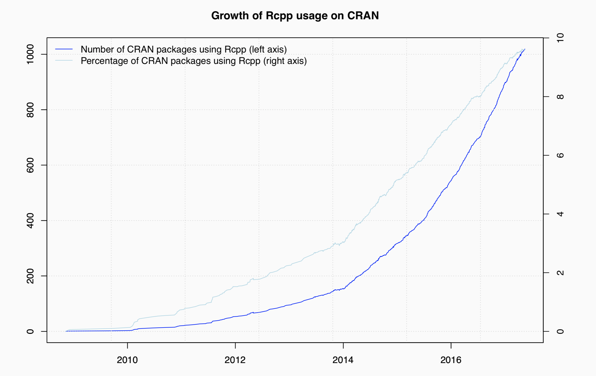

```{r setup, include=FALSE}
knitr::opts_chunk$set(echo = FALSE)
```

## About me

- Randy Lai <chushing.lai@maine.edu>
- a statistician
- an R enthusiast
- also in Python, Julia, a.k.a JuPyteR
- slides available at http://github.com/randy3k/rcpptalk


## About you

I assume that you

- have enough experiences with R
- at least know how to read C/C++ code


## Rcpp

### What

- Rcpp is an interface to C/C++ in R
- allow R user to write C/C++ code easily

### Why

(quoted from Dirk Eddelbuettel, one of the authors of Rcpp)

- Speed, Performance
- Do things you could not do before
- Easy to extend R this way


### How

- only lead you to the entrance of Rcpp world, the rest is left to you


## Speed Example

Consider a function defined as

$$
f(n) = \begin{cases}
n & \text{ for } n \le 1\\
f(n-1) + f(n-2) & \text{ for } n \ge 2
\end{cases}
$$

It is so called Fibonacci sequence

```{r, echo=T}
f <- function(n) {
  if (n < 2) return(n) 
  return(f(n-1) + f(n-2))
}
```

```{r, echo=T}
sapply(1:15, f)
```

## Speed Example (continue)

The equvilant C++ code is
```c
int g(int n) { 
  if (n < 2) return(n); 
  return(g(n-1) + g(n-2)); 
}
```

The `Rcpp` function `cppFunction` deploys the C++ code as follows
```{r, echo=T}
library(Rcpp)
cppFunction("
    int g(int n) { 
      if (n < 2) return(n); 
      return(g(n-1) + g(n-2)); 
    }
")
```
(we will discuss more about `cppFunction`)

## Speed Example (continue 2)

```{r, echo = T}
library(rbenchmark)
benchmark(f(20), g(20), 
          columns = c("test", "replications", "elapsed", "relative"), 
          order = "relative")
```

The C code is a few orders of magnitude faster then the R code.


## Who uses Rcpp?




## Perquisites

- RStudio
- Rcpp, of course

    ```
    install.packages("Rcpp")
    ```

- A C++ compiler
    - Windows: Rtools <br> https://cran.r-project.org/bin/windows/Rtools/
      
    - Mac: Xcode
    
    - Linux: you know better than me


## Two ways to use Rcpp

- `cppFunction` defines an inline R function from C++ code
    
    ```{r, echo=T, eval=F}
    cppFunction("
      int add(int x, int y, int z) {
        int sum = x + y + z;
        return sum;
      }
    ")
    ```


- `sourceCpp` loads specified c++ file 


## The Rcpp Interface

- standard c/c++ types: `int`, `double`, `bool`, `std::string`
- A generic representation: `SEXP`
- Rcpp vector classes: `NumericVector`, `IntegerVector`, `LogicalVector` and `CharacterVector`
- Rcpp matrix classes: `NumericMatrix`, `IntegerMatrix`, `LogicalMatrix` and `CharacterMatrix`
- and more ...

## Rcpp sugar

syntactic "sugar" to ensure that C++ functions work very similarly to their R equivalents. 

- arithmetic and logical operators for vectors and matrices
- logical functions: `any()`, `all()`, `is_true()`, `is_false()`
- math functions: `abs()`, `choose()`, `cos()`, `exp()`, `factorial()` and `floor()` etc
- stat functions: `mean()`, `min()`, `max()`, `sum()`, `sd()` and `var()` etc
- `dnorm`, `qnorm`... for all standard distributions.


## More examples

- Scalar input, scalar output
    - the `add` function above

- Vector input, scalar output

    ```{r, echo=T}
    cppFunction("
      double sumC(NumericVector x) {
        int n = x.size();
        double total = 0;
        for(int i = 0; i < n; ++i) {
          total += x[i];
        }
        return total;
      }
    ")
    ```


## Examples on sourceCpp

RStudio provides a very continient interface to write C++ code.

- `meanC.cpp`
- `timesTwo.cpp`


## Other related packages

Very often, plain C/C++ doesn't provide enough mathematical functions, e.g. matrix inverse and eigen decomposition

- RcppArmadillo: a lightweight but powerful linear algebra library

- RcppEigen: another lightweight linear algebra library

## References:

- http://adv-r.had.co.nz/Rcpp.html
- http://gallery.rcpp.org
- http://dirk.eddelbuettel.com/code/rcpp/Rcpp-quickref.pdf
- http://dirk.eddelbuettel.com/papers/useR2017_rcpp_tutorial.pdf
